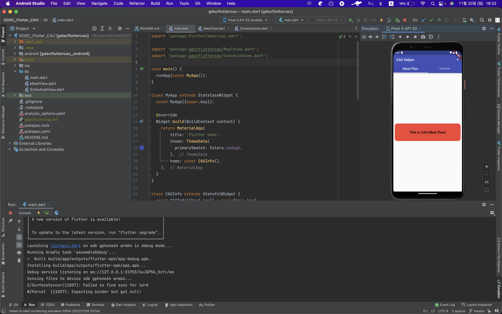
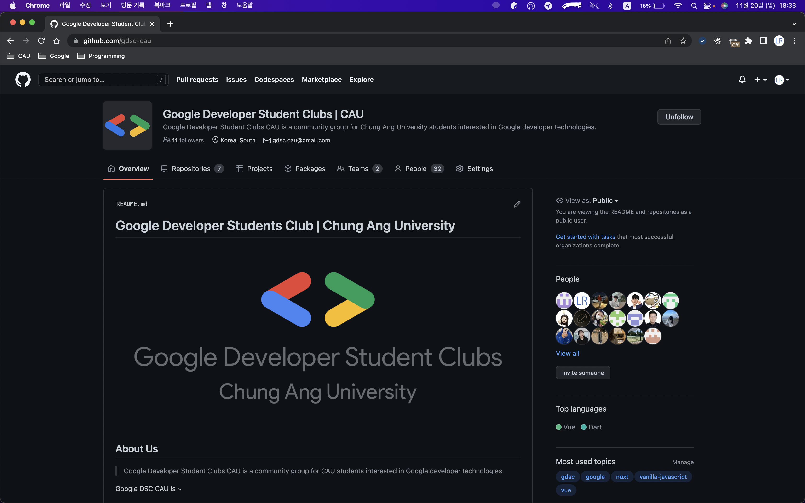
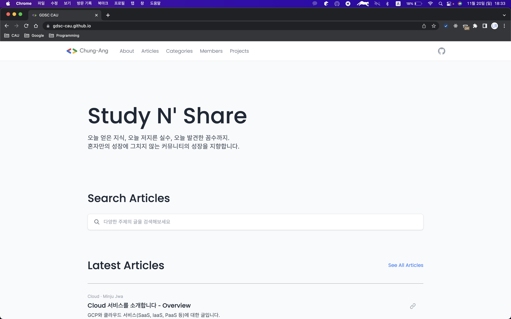

## CAU Helper

### 일상에서 자주 쓰이는 중앙대학교 포탈의 기능을 골라 정리하여 보여주는 Flutter 애플리케이션입니다.

---

### Team Information
- 유용민 (22-23 Core Member)
- 이주형 (22-23 Member)
- 한신 (22-23 Core Member)

### Tech Stacks
- Flutter
- Android Studio

---

### Screenshots (Optional)
</img>
> Image Description 1

</img>
> Image Description 2

</img>
> Image Description 3

---

### Others
- 백엔드 서버는 중앙대학교 포탈을 활용합니다.
- 개발 기간 : 2022. 09. ~ 2022. 12.
