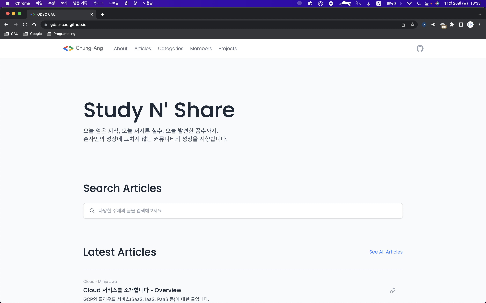

## 프로젝트 제목

#### 프로젝트 한줄 소개 (약 1, 2문장 정도)

---

### Team Information

| 이름 | 소속 | 역할 | Github |
|-----|-----|-----|--------|
| 팀원1 | 중앙대학교 소프트웨어학부 | Project Leader   Flutter 애플리케이션 개발 | [yymin1022](github.com/yymin1022) |
| 팀원2 | 중앙대학교 소프트웨어학부 | Back-End 서버 개발 | [smilebank7](github.com/smilebank7) |

---

### Tech Stacks

[이 Repository](https://github.com/Ileriayo/markdown-badges)
에서 원하는 Tech Stack 뱃지를 찾아 추가합니다.

---

### Screenshots (Optional)
</img>
> Image Description 1

</img>
> Image Description 2

</img>
> Image Description 3

---

### Others
- Other Informations
- Project Duration...
- Some URLs...
